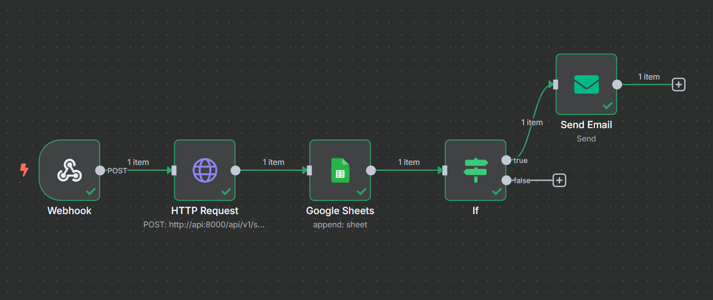

# n8n Workflow Documentation

This document details the n8n workflow implementation for the Voice-TimeLogger-Agent application.

## Overview

The workflow automates the process of:
1. Receiving audio files through a webhook
2. Processing them through our API for transcription and data extraction
3. Storing the extracted meeting data in Google Sheets
4. Sending email notifications for new meetings

## Workflow Architecture



The n8n workflow consists of the following nodes:

1. **Webhook** - Entry point that receives audio files
2. **HTTP Request** - Calls the API to process audio files
3. **Google Sheets** - Stores meeting data in a spreadsheet
4. **If** - Conditional node to control notification flow
5. **Send Email** - Sends notification emails

## Prerequisites

- n8n installed and running (via Docker Compose)
- Voice-TimeLogger-Agent API running and accessible
- Google Sheets account with API access
- SMTP email provider configured

## Workflow Components

### 1. Webhook Node

**Purpose**: Receives HTTP requests with audio file attachments
- **Method**: POST
- **Path**: Custom generated webhook path
- **Binary Data**: Enabled (property name: "data")

### 2. HTTP Request Node

**Purpose**: Calls the Voice-TimeLogger-Agent API to process the audio
- **Method**: POST
- **URL**: http://api:8000/api/v1/speech/process
- **Body Type**: multipart-form-data
- **Parameters**:
  - `file`: Binary file data from webhook (data0)
  - `notify`: Boolean flag to control notifications

### 3. Google Sheets Node

**Purpose**: Stores meeting data in a Google Spreadsheet
- **Operation**: Append
- **Spreadsheet**: Meeting logs spreadsheet
- **Columns**:
  - Timestamp
  - Customer Name
  - Meeting Date
  - Start Time
  - End Time
  - Total Hours
  - Notes

### 4. If Node

**Purpose**: Controls whether to send notifications
- **Condition**: Checks if notify parameter is "true"

### 5. Send Email Node

**Purpose**: Sends email notifications for new meetings
- **To**: Recipient email address
- **Subject**: "New Meeting Recorded: [Customer Name]"
- **Body**: HTML template with meeting details

## Setup Instructions

### 1. Import the Workflow

1. Access n8n at http://localhost:5678
2. Go to "Workflows" in the sidebar
3. Click "Import from File"
4. Select the `n8n_workflow/voice-timelogger-workflow.json` file

### 2. Configure Credentials

1. **Google Sheets**:
   - Open the Google Sheets node
   - Click "Create new credentials" or select existing ones
   - Follow the OAuth2 authentication process

2. **SMTP (Email)**:
   - Open the Send Email node
   - Click "Create new credentials" or select existing ones
   - Enter your SMTP settings:
     - Host: Your SMTP server (e.g., smtp-relay.brevo.com)
     - Port: 587
     - User: Your SMTP username
     - Password: Your SMTP password
     - SSL/TLS: STARTTLS

### 3. Configure Spreadsheet

1. Open the Google Sheets node
2. Select your target spreadsheet and sheet
3. Verify column mappings are correct

### 4. Activate the Workflow

1. Click the "Active" toggle in the upper right corner
2. Copy the webhook URL for later use

## Testing the Workflow

Test your workflow using curl or Postman:

```bash
curl --location 'http://localhost:5678/webhook/YOUR_WEBHOOK_PATH' \
--form 'file=@"/path/to/your/audio.mp3"' \
--form 'notify="true"'
```

Or use one of the provided example audio files:

```bash
curl --location 'http://localhost:5678/webhook/YOUR_WEBHOOK_PATH' \
--form 'file=@"examples/audio/example_meeting_1.mp3"' \
--form 'notify="true"'
```

## Troubleshooting

### Common Issues

**Binary Data Errors:**
- Ensure the binary property name in the Webhook matches what's used in the HTTP Request node
- Check that the file is being uploaded correctly

**Connection Issues:**
- If using Docker, ensure the API and n8n services can communicate
- Check the URL in the HTTP Request node (use service name from docker-compose)

**Credential Errors:**
- Verify Google Sheets authentication
- Check SMTP credentials are correct

### Viewing Execution Logs

- Go to "Executions" in the n8n sidebar
- Click on a specific execution to view details
- Check for any error messages